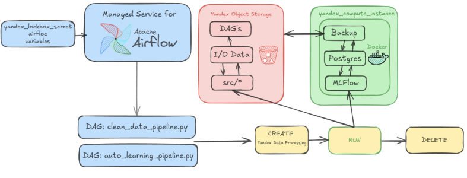
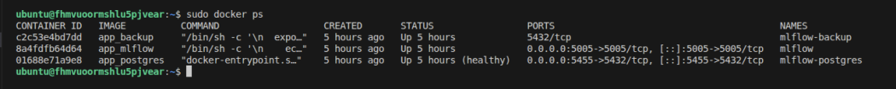
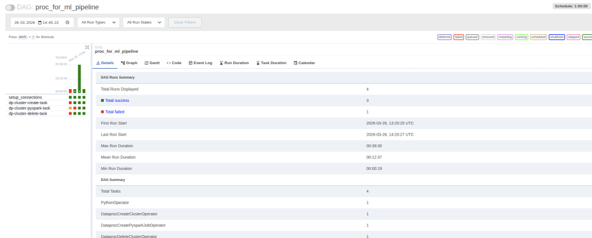
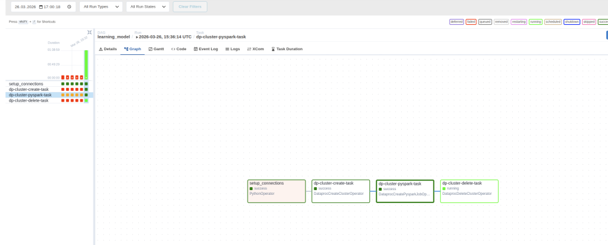
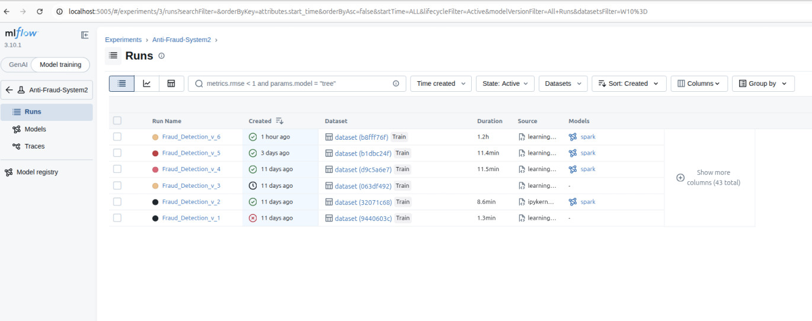
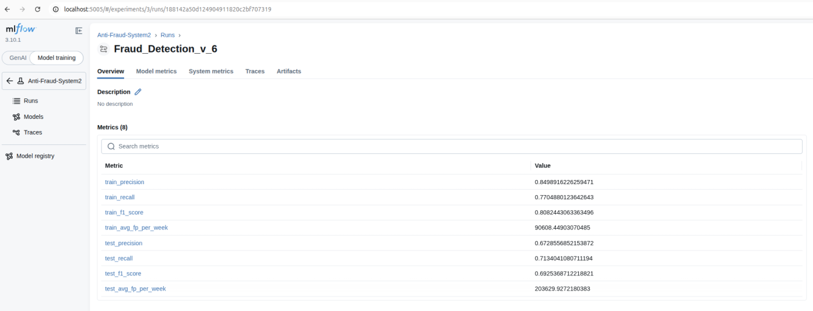
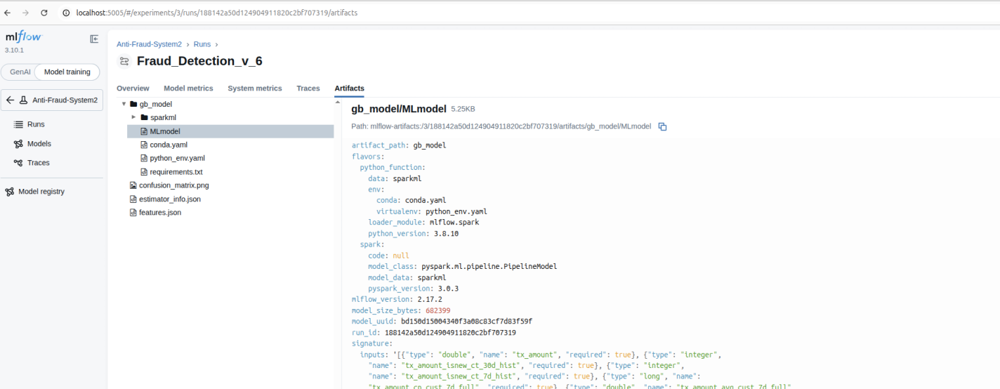
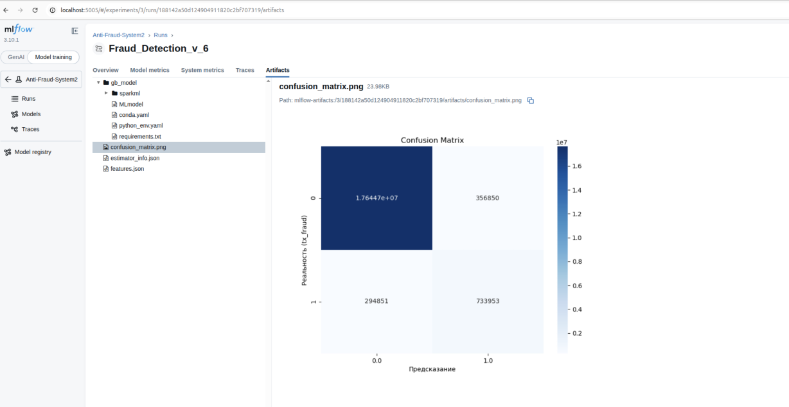
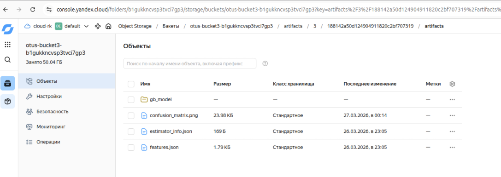
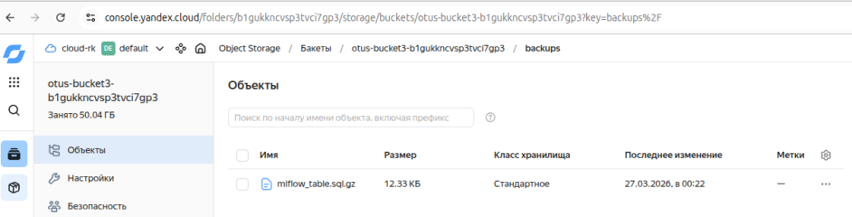

.

Задания:
1. Система Apache Airflow развёрнута из terraform, необходимые переменные переданы через секреты yandex.
2. Развернута виртуальная машина с docker, в неё передаются докер файлы и docker-compose, развёртываются три контейнера: 
- MLFlow 
- postgres
- backup (для периодического сохранения БД mlflow в s3 бакет), при загрузке контейнера postgres если БД пустая, подтягивается бэкап.

.

3. Создано два python скрипта:
- proc_for_ml_data.py - для подготовки данных. Вычисляются статистики по окнам, рейты (отношения к текущему значению) и фрод-риск терминала. 
  Для борьбы с перекосом данных (есть терминалы с миллионами записей) написаны отдельные функции,вычисляющие исторические данные через временные бакеты.
- learning.py - скрипт обучения. Добавляет некоторые простые признаки (вычисляемые просто позначению  колонки, например день или ночь) и обучает модель градиентного бустинга (spark).
  Очень долго как преобразовывает данные так и обучает, провёл обучение 1 раз да и то на 3х файлах. Обучался 1.2 часа на максимальной доступной конфигурации spark кластера.
  ( для данной задачи лучше больше слабых нод кластера, чем пара сильных, нужно много места на дисках)

.

.

4. Метрики сохраняются в postgres и бакапируются, артефакты и модели сохраняются в отдельный бакет.

.

.

.

.

.

.

5. Даги для задач подготовки данных и обучения настроены для периодического сохранения модели. 